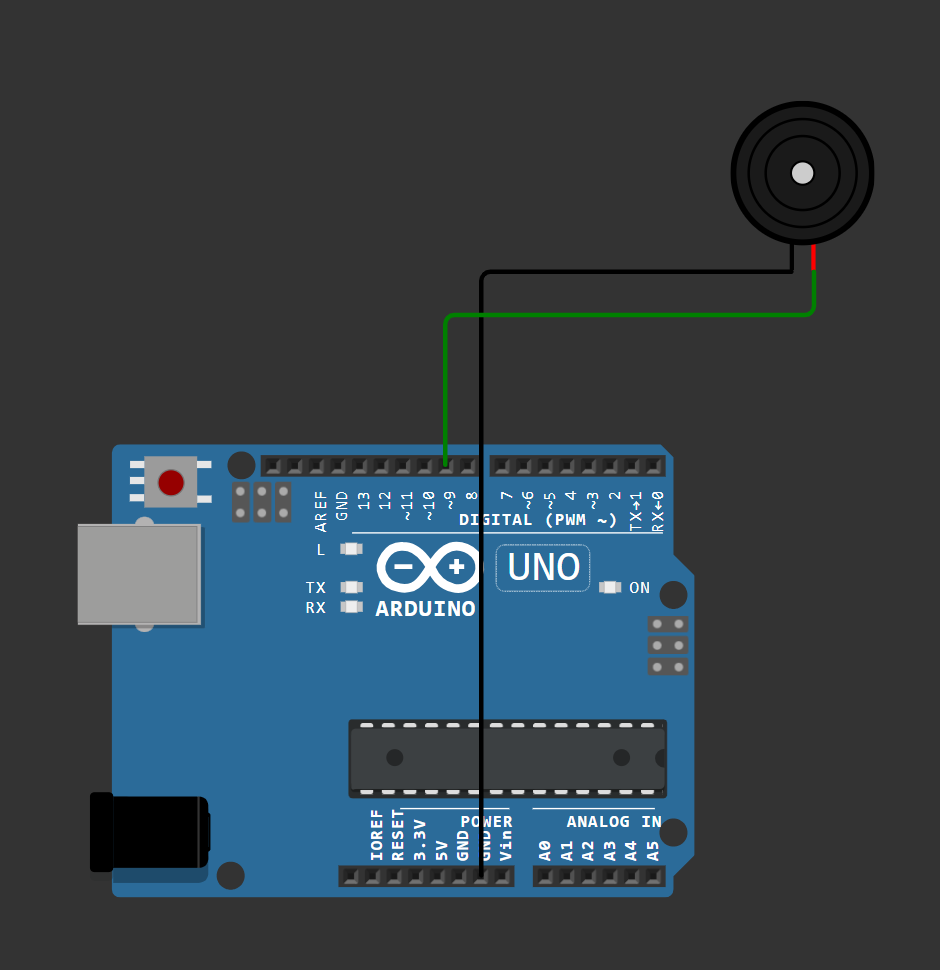
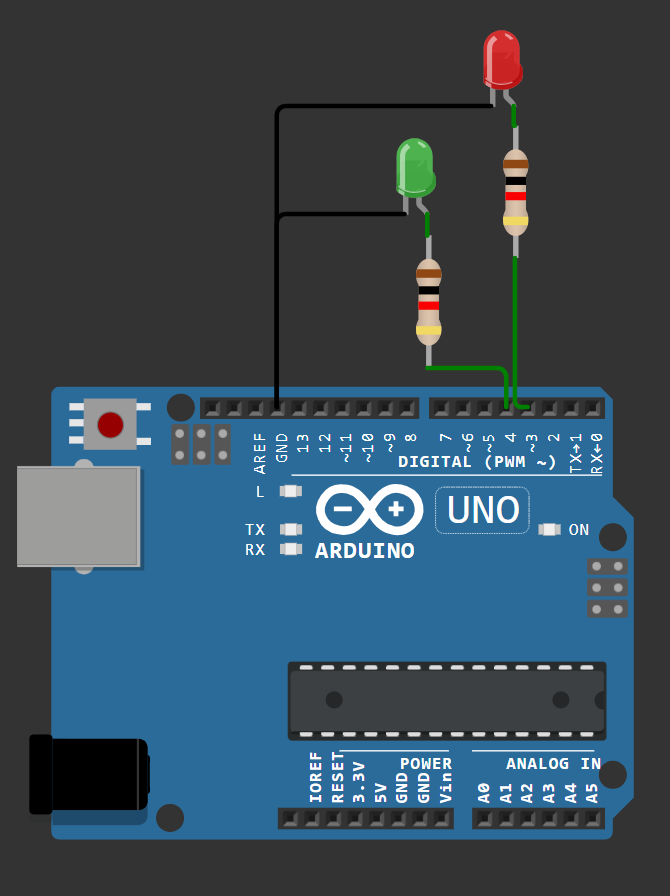

# Algemene werkwijze

De opbouw van de finale code van de code ging als volgt: 
1. De code voor de verschillende componenten werd eerst apart geschreven. Zo kon van elk component de werking getest worden via WokWi-simulaties en konden noodzakelijke functies geïdentificeerd worden. Hierbij werd gebruikgemaakt van libraries en de leerstof uit de lessen. 

    - Buzzer:
    De buzzer werd getest met de functie `tone()` om geluid te genereren. 
      

    - Knoppen:
    Deze code bevat de werking van 2 knoppen. Die zorgen voor het instellen van de tijd: +/- 30 seconden. De aan/uit knop en de knop om het agtellen te beginnen moeten later toegevoegd worden bij het samenbrengen van de verschillende componenten. 
      

    - LED's:
    In deze code werden 2 ledlichten afwisselend aan- en uitgeschakeld, bij elke verandering werd vervolgens een boodschap geprint. Het doel van deze code is om de staat van de LED's de veranderen na aangegeven tijdsspannes.  
      

    - Scherm:
    In deze code werd voornamelijk onderzocht hoe het LCD-scherm diende aangestuurd te worden en welke libraries hiervoor vereist waren. Het scherm printte hierbij enkel een boodschap. 
      

 

2. De codes van de LED's en de buzzer werden vervolgens samengevoegd, alsook degene van het scherm en de knoppen. 

    - Buzzer + LED's:
    In deze code werden de LED's gekoppeld aan de buzzer, bij elke statusverandering zal nu een geluid klinken. 
      

    - Knoppen + scherm:
    In deze code werden de laatste 2 knoppen bijgevoegd: aan/uit en het starten van de timer. 
    Verder werd ervoor gezorgd dat alle knoppen interageren met het scherm zonder dat dit knippert. 
      

 

3. Finaal werden beide codes samengevoegd tot een geheel werkend product. 
    - Finale samenstelling:
    In deze code werden alle componenten samengevoegd. De LED's zullen uitzonderlijk branden wanneer de timer loopt. 
    Bij elke LED-verandering, het indrukken van de aan/uit-knop en bij het starten van de timer klinkt een geluid.
    De boodschappen die op het scherm verschijnen, zijn verbonden met de statusveranderingen van de LED's.
    Verder werd een effectieve studietijd toegevoegd, dit is de tijd zonder pauze.
    Het scherm werd aangesloten op een component die slechts 4 pinnen vereist, dit zorgt voor extra gebruiksgemak bij het aansluiten van de pinnen. 
      

>De codes van al deze afzonderlijeke stappen kunnen [hier](../Arduino/README.md) terug gevonden worden.

>OPMERKING: De afbeeldingen bevatten een link naar de WokWi-simulatie. De aparte links kunnen [hier](../Docs/links.md)terug gevonden worden.