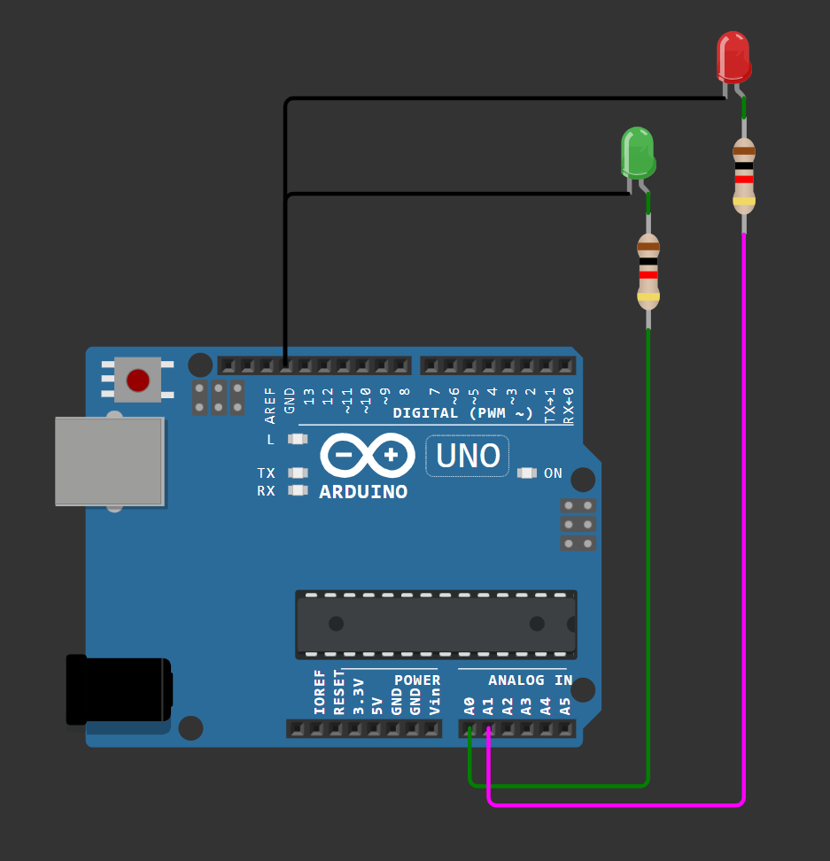
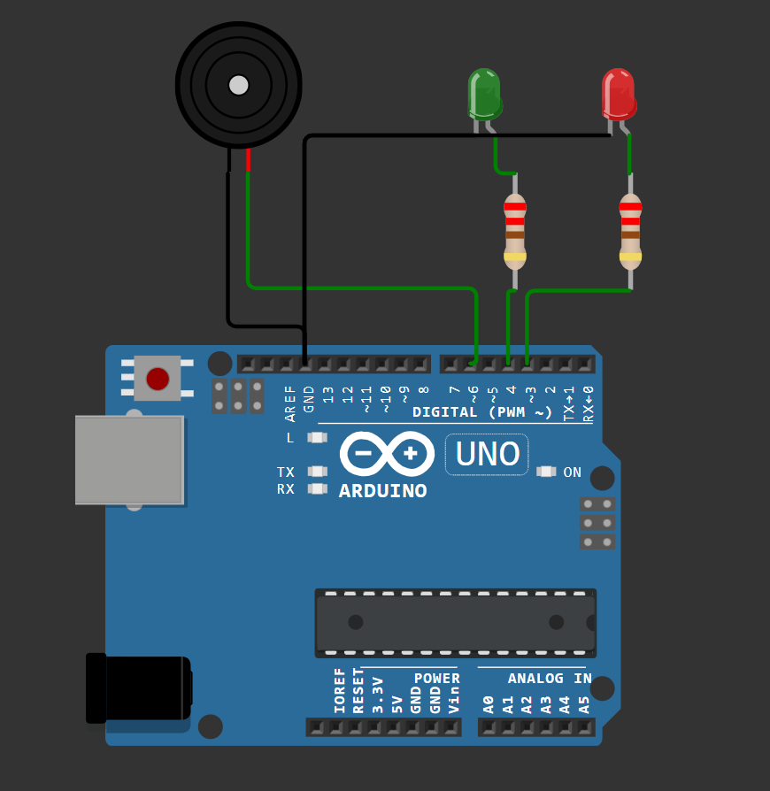
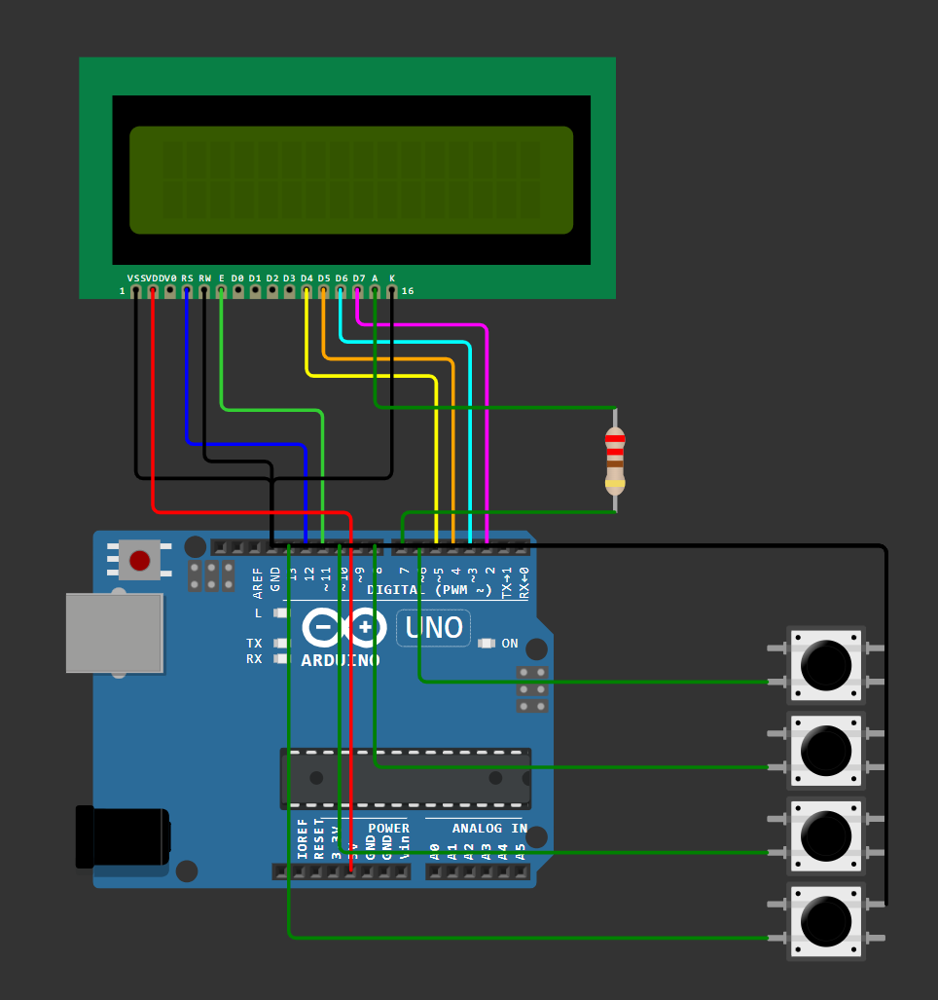
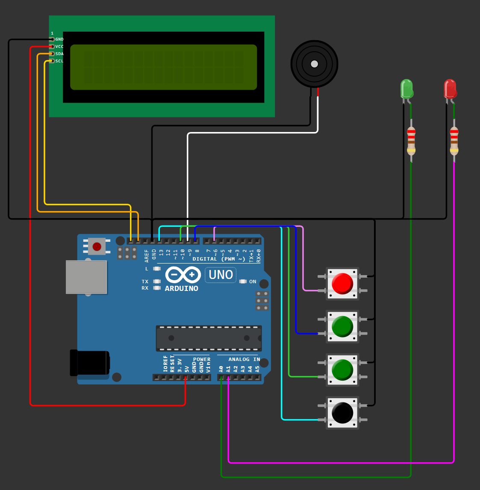

# Opstellingen 

## Componenten apart

**Deel geluid**

**Deel knoppen**

**Deel leds**

**Deel scherm**

## Componenten aan elkaar gelinkt

**Deel leds en geluid**

**Deel scherm en knoppen**

## Alle componenten samen

> OPMERKING
>In werkelijkheid lukte het niet om het lcd scherm aan te krijgen, daarom werd er overgeschakeld naar een lcd I2C scherm.