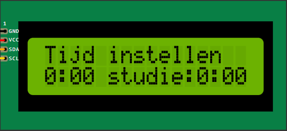
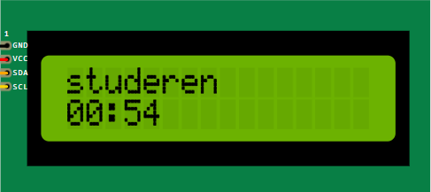
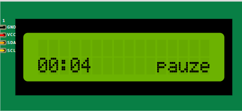
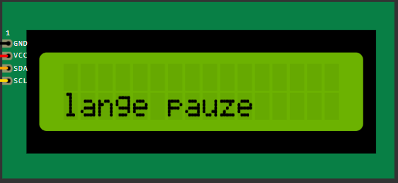

# Pomodoro-timer

## Teamleden
- Leen Geenens
- Loes Vanmeerbeek
- Luna Van Tittelboom

## Doelstellingen
1. Vooraf instellen hoelang er gestudeerd moet worden.
    - Het instellen gebeurt in sprongen van 30 minuten.
    - Pauze zit er dus ingerekend.
2. Na elke 25 minuten werken volgt er een pauze van 5 minuten pauze.
3. Na vier keer stap 2 te doorlopen volgt er een pauze van 30 minuten.

In arduino:
- werken = 25 seconden
- korte pauze = 5 seconden
- lange pauze = 10 seconden + 5 seconden 

## Verschillende componenten

### Scherm
Hierop zie je de tijd en kan je instellen hoe lang je wilt werken. Naast het instellen wordt er ook weergegeven hoeveel tijd je werkelijk studeert, dus de tijd zonder pauzes. 

Het scherm zal ook weergeven in welke status je je bevindt, zo verschijnt er studeren op wanneer het groene lichtje brandt en (lange) pauze wanneer het rode lichtje brandt.

### Knoppen
De timer zal in totaal vier verschillende knoppen hebben:
- Een aan- en uitknop
- Een knop om de timer te starten
- Een knop om de tijd te verhogen
- Een knop om de tijd te verlagen

### Leds
Er zullen twee leds aanwezig zijn.
- Een groen ledje voor tijdens het studeren.
- Een rood ledje voor tijdens de pauze.

Deze leds branden wanneer er op de knop om de timer te starten wordt gedrukt.

### Geluid
Bij elke kleurwisseling van de leds zal er een ping geluid te horen zijn, alsook bij het starten en eindigen van de timer.

## Algemene werkwijze
De opbouw van de code ging als volgt:
- De code voor de componenten werd apart geschreven, zo kon van elk de werking getest worden.
- De code van de leds en de speaker werd vervolgens samengevoegd, alsook degene van het scherm en de knoppen.
- Finaal werden beide codes samengevoegd tot een geheel werkend product.

## Documenten
1. [Links](Docs/links.md)
2. [Opstellingen](Docs/opstellingen.md)
3. [videos](<Filmpjes fysieke opstellingen/README.md>)