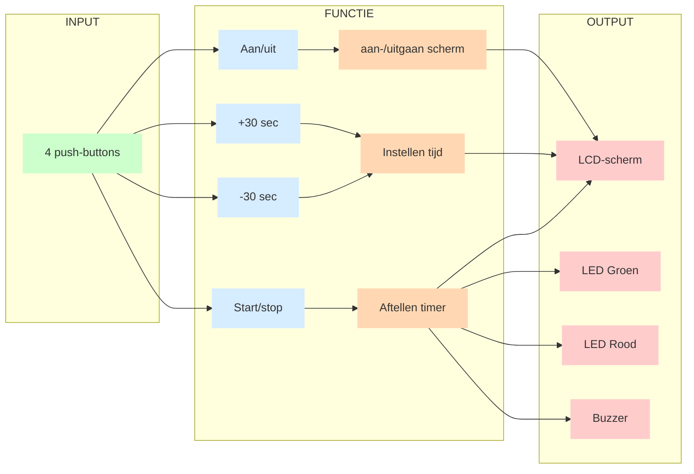

# Pomodoro-timer
*AC 2025-2026*
## Teamleden
- *Leen Geenens*
- *Loes Vanmeerbeek*
- *Luna Van Tittelboom*

## Inleiding

Dit project omvat de opbouw van een Pomodoro timer.

Een Pomodoro timer is een tijdmanagementtechniek waarbij werk wordt opgedeeld in korte, gefocuste werkblokken van meestal 25 minuten, afgewisseld met korte pauzes van 5 minuten.

Tijdens zo’n “Pomodoro”-blok werk je geconcentreerd aan één taak zonder afleiding. Na 4 cycli (120 min) neem je een langere pauze van 10 minuten.

Het doel van een Pomodoro timer is om de concentratie te verbeteren, uitstelgedrag te verminderen en productiviteit op een haalbaar en ritmisch tempo te verhogen.

## Doelstellingen 
1. Vooraf instellen hoelang (hoeveel Pomodoro's) er gestudeerd moet worden.
    - Het instellen van de tijd gebeurt in sprongen van 30 minuten, hierin is de pauzetijd inbegrepen.
2. Na elke 25 minuten werken volgt er een pauze van 5 minuten pauze.
3. Na vier keer een Pomodoro te doorlopen volgt er een lange pauze van 10 minuten.

**In Arduino:**
- studeren = 25 seconden
- korte pauze = 5 seconden
- lange pauze = 10 seconden

In de code van Arduino wordt gebruik gemaakt van seconden en niet van minuten. Op deze manier kan de werking van de code snel geobserveerd worden.

## Verschillende componenten

| Component| Uitleg |
|:------|:------|
|Scherm| Op het scherm kan de gebruiker door middel van knoppen intsellen hoelang deze wenst te werken. Naast het instellen wordt er ook weergegeven hoeveel tijd werkelijk gestudeerd zal worden, dit is dus de tijd zonder pauzes.     Wanneer de timer gestart wordt zal het scherm ookook de aftellende tijd weergeven, hierbij zal het scherm tevens weergeven in welke status de gebruiker zich bevindt (studeren/pauze/lange pauze).    |
|Knoppen|De timer zal in totaal vier verschillende knoppen hebben:  - Een aan- en uitknop van het toestel - Een knop om de timer te starten - Een knop om de tijd te verhogen (+ 30sec) - Een knop om de tijd te verlagen (-30 sec) |
|LED's|Er zullen twee LEDs aanwezig zijn. - Een groen LED die oplicht tijdens het studeren. - Een rood LED die oplicht tijdens de pauze. Deze leds zullen dus branden wanneer de tijd van de timer loopt. |
|Geluid|Bij elke kleurwisseling van de LED's zal er een ping geluid te horen zijn, alsook bij het starten en eindigen van de timer.|

## Algemene werking

In een onderstaand schema is weergegeven hoe de componenten (in- en output) en functies verbonden worden om de connecties in het systeem te verduidelijken.

## Verdere uitleg
1. [Algemene werkwijze](<Algemene werkwijze/README.md>)
## Documenten
1. [Links WokWi-simulaties](Docs/links.md)
2. [Samenvatting codes Arduino](Arduino/README.md)
3. [Videos fysieke opstellingen](<Filmpjes fysieke opstellingen/README.md>)

## Kritische reflectie

Tijdens dit project hebben we veel nieuwe kennis en vaardigheden opgedaan over arduino, aangezien dit onze eerste ervaring was hiermee. Tijdens het proces kwamen we verschillende uitdagingen tegen die ons een beter inzicht gaven in zowel de hardware als software.

### Programmeren

Een moeilijkheid was het probleem van de knopdebounce. In het begin zorgde dit voor onstabiele invoer, maar na verder onderzoek en testen slaagden we erin om een oplossing te vinden zonder gebruik te maken van een library. Doordat de taken onderling werden verdeeld bij het coderen van de afzonderlijke componenten werden hiervoor 2 afzonderlijke oplossingen gevonden, deze zijn zichtbaar in de finale code.

Bijkomend doorliep het project een moeilijk proces, omdat we voortdurend verschillende technische problemen tegen kwamen die opgelost dienden te worden. Zo moesten we ervoor zorgen dat de tijd correct bleef aftellen, dat het scherm niet begon te knipperen en dat tekst niet over elkaar heen werd geschreven. Daarnaast liep de tijd aanvankelijk niet verder door tijdens de lange pauze, wat eveneens opgelost moest worden. Ook bij het opnieuw opstarten van het systeem mochten oude teksten niet overschreven worden en moest het volledige scherm correct leeggemaakt worden bij het uitschakelen. Deze problemen vereisten veel testen, aanpassen en opnieuw programmeren. Een groot deel van deze problemen keerde terug bij het toevoegen van een functie waardoor de code telkens op verschillende plaatsen aangepast diende te worden.

Doorheen het project hebben we meerdere iteraties doorlopen waarbij we stap voor stap componenten samenbrachten, nieuwe functionaliteiten toevoegden en problemen oplosten die tijdens het proces naar voren kwamen. Achteraf bekeken hadden we onze code compacter en overzichtelijker kunnen maken door vaker gebruik te maken van functies en door meer structuur in de code aan te brengen. Onze aanpak echter zorgde ervoor dat we eenvoudig startten, stap voor stap vooruit gingen, en zo overzichterlijk te werk gingenen aldus meer inzicht verwierven in de mogelijkheden en werking van Arduino.

### Fysiek maken prototype 

Het fysiek aansluiten van het scherm bleek complexer dan verwacht: door de vele kabels was er telkens slecht contact waardoor we moeilijkheden ondervonden om het scherm correct aan te sluiten. Om dit probleem op te lossen werd uiteindelijk gebruik gemaakt van een component die de verbinding van het scherm reduceerde tot slechts vier pinnen, wat de integratie aanzienlijk vergemakkelijkte. Hiervoor werd een library gebruikt en werden online video's bekeken hoe dit aangesloten diende te worden, zowel fysiek als in de code.

Het ontwikkelen van input- en outputvalidatiescripts had ons aanzienlijk kunnen helpen tijdens het fysiek opbouwen van het prototype, doordat ze sneller hadden kunnen aantonen of de schermen correct functioneerden en of eventuele problemen te wijten waren aan de bekabeling en aansluitingen in plaats van de code. Hierdoor had de foutopsporing bij de montage efficiënter kunnen verlopen en was mogelijk vroeger duidelijk geworden waar de knelpunten zich bevonden. Deze scripts werden echter pas later ontwikkeld, maar kunnen bij toekomstige opstellingen wel van nut zijn.

Een ander probleem dat bij het fysiek aansluiten naar boven kwam was het vaststellen van de juiste weerstanden. In WokWi werden geen of foute weerstanden aangesloten, waar dit wel noodzakelijk was bij de fysieke componenten.

Kortom werden veel uitdagingen ontdekt bij het fysiek maken van het prototype, problemen die niet terug te vinden waren in de code en de online simulaties in WokWi. Hieruit leerden we eerder hadden moeten overschakelen op het bouwen van fysieke prototypes.

