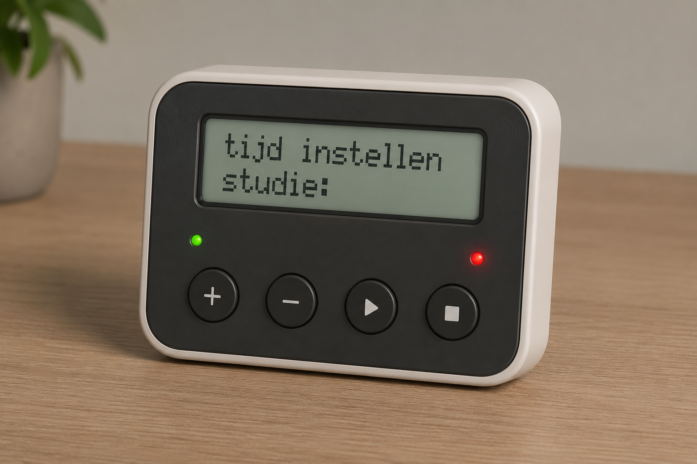
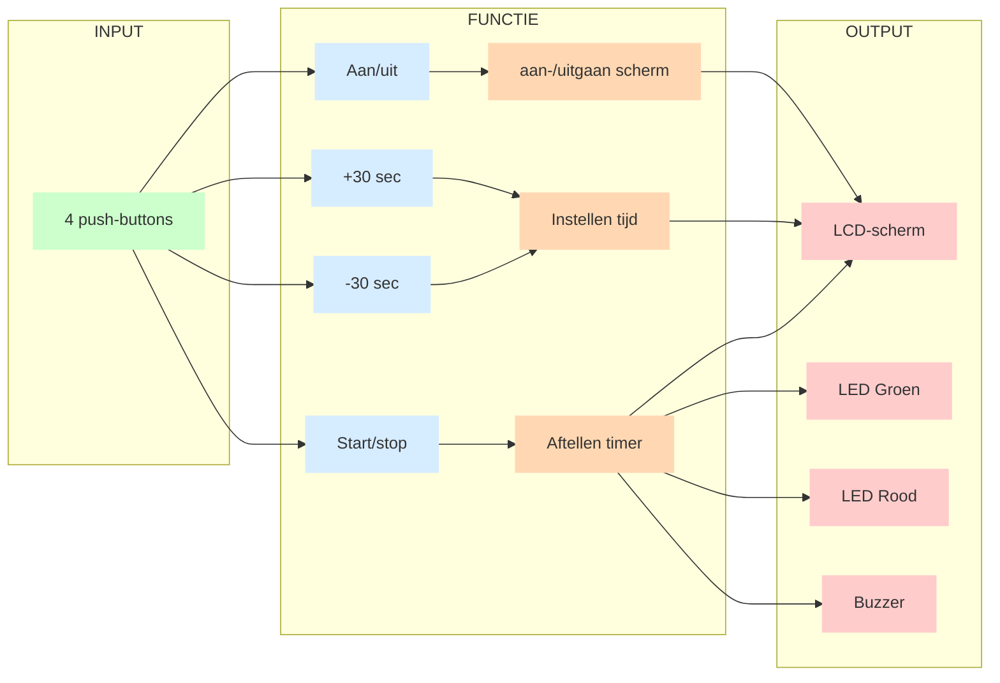

# Pomodoro-timer

## Teamleden
- *Leen Geenens*
- *Loes Vanmeerbeek*
- *Luna Van Tittelboom*

## Inleiding

Dit project omvat de opbouw van een Pomodoro timer.

*Een Pomodoro timer is een tijdmanagementtechniek waarbij werk wordt opgedeeld in korte, gefocuste werkblokken van meestal 25 minuten, afgewisseld met korte pauzes.

Tijdens zo’n “pomodoro” werk je geconcentreerd aan één taak zonder afleiding. Na elke werkperiode volgt een korte pauze (bijvoorbeeld 5 minuten) om te ontspannen. Na een aantal cycli neem je een langere pauze.

Het doel van een Pomodoro timer is om de concentratie te verbeteren, uitstelgedrag te verminderen en productiviteit op een haalbaar en ritmisch tempo te verhogen.*

## Doelstellingen
1. Vooraf instellen hoelang er gestudeerd moet worden.
    - Het instellen gebeurt in sprongen van 30 minuten.
    - Pauze zit er dus ingerekend.
2. Na elke 25 minuten werken volgt er een pauze van 5 minuten pauze.
3. Na vier keer stap 2 te doorlopen volgt er een lange pauze van 30 minuten.

**In Arduino:**
- studeren = 25 seconden
- korte pauze = 5 seconden
- lange pauze = 10 seconden + 5 seconden 

## Verschillende componenten

| Component| Uitleg |
|:------|:------|
|Scherm| Hierop zie je de tijd en kan je instellen hoe lang je wilt werken. Naast het instellen wordt er ook weergegeven hoeveel tijd je werkelijk studeert, dus de tijd zonder pauzes.    Het scherm zal ook weergeven in welke status je je bevindt, zo verschijnt er studeren op wanneer het groene lichtje brandt en (lange) pauze wanneer het rode lichtje brandt.    |
|Knoppen|De timer zal in totaal vier verschillende knoppen hebben:  - Een aan- en uitknop - Een knop om de timer te starten - Een knop om de tijd te verhogen - Een knop om de tijd te verlagen |
|LED's|Er zullen twee leds aanwezig zijn. - Een groen ledje voor tijdens het studeren. - Een rood ledje voor tijdens de pauze. Deze leds branden wanneer er op de knop om de timer te starten wordt gedrukt. |
|Geluid|Bij elke kleurwisseling van de leds zal er een ping geluid te horen zijn, alsook bij het starten en eindigen van de timer.|

## Algemene werking

Onderstaand is een schema weergegeven waarin componenten (in- en output) en functies verbonden worden om de connecties in het systeem te verduidelijken.

## Verdere uitleg
1. [Algemene werkwijze](<Algemene werkwijze/README.md>)
## Documenten
1. [Links WokWi-simulaties](Docs/links.md)
2. [Samenvatting codes Arduino](Arduino/klad.ino)
3. [Videos fysieke opstellingen](<Filmpjes fysieke opstellingen/README.md>)

## Kritische reflectie

Tijdens dit project hebben we veel nieuwe kennis en vaardigheden opgedaan, aangezien dit onze eerste ervaring was met Arduino. Tijdens het proces kwamen we verschillende uitdagingen tegen die ons hielpen om beter inzicht te krijgen in zowel hardware als software.

Een moeilijkheid was het probleem van de knopdebounce. In het begin zorgde dit voor onstabiele invoer, maar na verder onderzoek en testen slaagden we erin om hiervoor een oplossing te vinden zonder gebruik te maken van een library. Doordat de taken werden verdeeld bij het coderen van de afzonderlijke componenten werden hiervoor 2 afzonderlijke oplossingen gevonden, deze zijn zichtbaar in de finale code.

Het project werd echter als een moeilijk proces ervaren, omdat we voortdurend verschillende technische problemen tegen kwamen die opgelost diende te worden. Zo moesten we ervoor zorgen dat de tijd correct bleef aftellen, dat het scherm niet begon te knipperen en dat tekst niet over elkaar heen werd geschreven. Daarnaast liep de tijd aanvankelijk niet verder door tijdens de lange pauze, wat eveneens opgelost moest worden. Ook bij het opnieuw opstarten van het systeem mochten oude teksten niet overschreven worden en moest het volledige scherm correct leeggemaakt worden bij het uitschakelen. Deze problemen vereisten veel testen, aanpassen en opnieuw programmeren. veel van deze problemen kwamen terug bij het toevoegen van een functie waardoor de code telkens op verschillende plaatsen aangepast diende te worden.

Doorheen het project hebben we meerdere iteraties doorlopen waarbij we stap voor stap componenten samenbrachten, nieuwe functionaliteiten toevoegden en problemen oplosten die tijdens het proces naar voren kwamen. Achteraf bekeken hadden we onze code compacter en overzichtelijker kunnen maken door vaker gebruik te maken van functies en een betere structuur in de code aan te brengen. Deze werkwijze zorgde ervoor dat we gestructureerd te werk gingen en eenvoudiger begonnen.

Bij het fysiek aansluiten van het scherm bleek dit complexer dan verwacht, door de vele kabels was er telkens slecht contact waardoor veel moeilijkheden werden ondervonden met dit correct aan te sluiten. Om dit probleem op te lossen werd uiteindelijk gebruikgemaakt van een component die de verbinding van het scherm reduceerde tot slechts vier pinnen, wat de integratie aanzienlijk vergemakkelijkte. Hiervoor werd een library gebruikt en werden online videos bekeken op hoe dit aangesloten diende te worden zowel fysiek als in de code.

Een ander probleem dat bij het fysiek aansluiten naar boven kwam was het vinden van de juiste weerstanden. In wokwi werden foute of geen weerstanden aangesloten, waar dit wel noodzakelijk was bij de fysieke componenten.

Kortom werden veel drempels ontdekt bij het fysiek maken van het prototype, dit waren problemen die niet terug te vinden waren in de code en de online simulaties in WokWi. Dit impliceerde dat we eerder hadden moeten overschakelen op het bouwen van fysieke prototypes.

